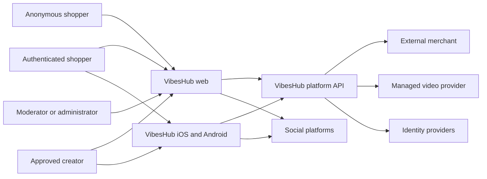
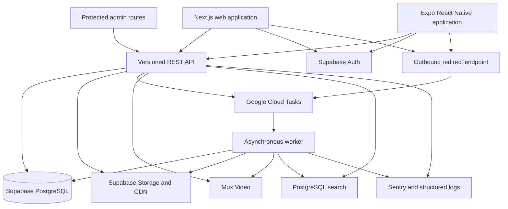

# VibesHub system architecture

**Status:** Accepted baseline

**Date:** 2026-08-06

## 1. Architectural drivers

The supplied VibesHub screens and product decisions establish these drivers:

- Public creator, category, product, and trending pages must be fast, indexable, and shareable.
- The same public links must work on mobile web and deep-link into installed native applications.
- Anonymous shoppers can browse; authentication is required for saving, following, reporting, and creator actions.
- Creators manage profiles, recommendations, merchant links, codes, images, story clips, and analytics.
- Product URL importing, media processing, code validation, link checking, search indexing, and metric aggregation are asynchronous workloads.
- Products are shared catalog records while reviews, clips, codes, and attribution remain creator-specific.
- The interface is English while creator content is primarily Hebrew, requiring mixed-direction rendering and bilingual search.
- Moderation and administrative operations are part of the minimum viable platform.
- The first release redirects shoppers to external merchants and does not own checkout, inventory, orders, or payouts.

## 2. System context



## 3. Container architecture



## 4. Repository layout

The project uses a pnpm workspace and Turborepo task graph.

```text
apps/
  web/                 Next.js public web, account, creator studio, admin
  mobile/              Expo Router iOS and Android application
  api/                 NestJS/Fastify versioned API
  worker/              Job handlers and scheduled workloads

packages/
  contracts/           OpenAPI schemas, generated clients, shared DTO validation
  domain/              Pure business rules and domain types
  database/            SQL migrations, query layer, seeds, test factories
  design-tokens/       Color, spacing, typography, radii, motion tokens
  analytics/           Event names, payload schemas, attribution helpers
  auth/                Shared claims and capability definitions
  observability/       Logging, tracing, error-reporting adapters
  config/              TypeScript, linting, formatting, test configuration

docs/
  architecture/        Product decisions, ADRs, ERD, API and security documents
```

UI implementations are platform-specific. Web and native share design tokens, contracts, domain validation, analytics definitions, and selected non-visual utilities; they are not forced into a single component tree.

## 5. Client responsibilities

### Next.js web

- Render public discovery, creator, category, recommendation, About, and shopper-information pages.
- Generate SEO metadata, canonical URLs, sitemaps, and social preview images.
- Cache public read models and invalidate them after publication changes.
- Provide responsive shopper account and creator studio experiences.
- Host protected moderator and administrator routes.
- Never contain the sole implementation of a core write rule that native clients also require.

### Expo native

- Provide native discovery, search, story viewing, saved content, and account experiences.
- Support essential creator profile, recommendation, video, code, publication, and analytics actions.
- Register iOS Universal Links and Android App Links for public VibesHub URLs.
- Store sessions using platform-secure storage.
- Use native push-notification, sharing, image-picker, camera, and upload capabilities.

## 6. API responsibilities

The API is the authoritative business boundary for web and native clients.

- Verify Supabase-issued access tokens.
- Resolve capabilities such as shopper, applicant, creator, moderator, and administrator.
- Validate all commands and state transitions.
- Own privileged database writes.
- Issue short-lived upload authorizations.
- Create asynchronous jobs.
- Expose public cursor-paginated read endpoints.
- Produce stable OpenAPI contracts and generated TypeScript clients.
- Enforce idempotency for externally retried commands.

The API is a modular monolith. Initial modules are:

```text
identity
profiles
creator-applications
creators
catalog
recommendations
discounts
media
discovery
social
affiliate-links
analytics
moderation
notifications
administration
```

Modules communicate through explicit services and domain events rather than directly changing one another's tables without ownership rules.

## 7. Worker responsibilities

The worker runs retryable, observable job handlers:

- fetch and normalize supported merchant product pages
- ingest approved external images
- react to Mux upload and asset webhooks
- refresh search documents
- validate redirect destinations and link health
- expire or mark stale discount codes
- aggregate creator analytics
- calculate trending scores
- deliver email and push notifications
- process account export and deletion
- clean abandoned uploads and drafts

Every job has:

- a stable job type and versioned payload
- an idempotency key
- bounded retries and exponential backoff
- a dead-letter or failed state
- structured logs and trace correlation
- explicit timeout and maximum payload size

## 8. Authentication and authorization flow

1. Web or native authenticates with Supabase Auth.
2. The client receives a short-lived access token and refresh mechanism.
3. API requests include the access token.
4. The API verifies issuer, audience, signature, expiry, and required claims.
5. The API loads platform capabilities and ownership context.
6. The command or query executes only after authorization.

The token proves identity; it does not independently grant creator verification or administrative access. Platform capabilities remain server-controlled records.

Supabase service-role credentials are server-only and never shipped to web or native clients.

## 9. Data and read-model strategy

PostgreSQL is the system of record.

- Normalized write models preserve product, offer, recommendation, code, media, and creator ownership.
- Public feeds use denormalized query views or read tables so they do not perform large fan-out joins per card.
- Public lists use stable cursor pagination.
- Append-only interaction events are summarized into daily creator and recommendation metrics.
- Search documents are derived data and can be rebuilt from PostgreSQL.
- Media provider identifiers are references; VibesHub remains authoritative for ownership, visibility, moderation, and placement.

The detailed ERD and table ownership map are defined in the next architecture step.

## 10. Public caching and invalidation

- Static assets and eligible page output are served through Vercel's CDN.
- Creator, category, and recommendation pages use cached public read models.
- Publication changes emit invalidation events containing affected creator, product, category, and feed keys.
- Personalized account and creator-studio responses are private and not shared-cacheable.
- Stale public content may be served briefly during downstream failure, but removed or blocked content must use a high-priority invalidation path.

Cache keys never include raw access tokens or personally identifying values.

## 11. Product import flow

1. An approved creator submits an HTTPS merchant URL.
2. The API canonicalizes and validates the URL without fetching it.
3. The API creates an import attempt and queues a job.
4. The worker resolves DNS and rejects loopback, link-local, private, internal, and unsupported destinations before each redirect.
5. The worker applies response size, content type, redirect, and time limits.
6. A supported merchant adapter or structured-data parser extracts a product candidate.
7. The worker checks existing canonical products and offers for duplicates.
8. Permitted media is ingested into controlled storage.
9. The creator receives an editable draft.
10. Submission enters the configured moderation and publication flow.

The importer's network environment must not have privileged access to internal services.

## 12. Media flow

### Images

- The API creates a media record and short-lived signed upload authorization.
- Clients upload directly to storage.
- A worker verifies format, size, dimensions, checksum, and metadata.
- Approved renditions are generated and published through the CDN.
- Originals remain private when they are not required for public delivery.

### Video

- The API creates a pending video record and authenticated Mux direct-upload URL.
- The client uploads directly to Mux.
- Signed, replay-protected Mux webhooks advance processing state.
- Playback and thumbnail identifiers are stored only after asset validation.
- Recommendation placement is separate from the video asset itself.

## 13. Analytics and redirect flow

The redirect endpoint is optimized for shopper latency and availability.

1. Resolve the active affiliate link from a non-sequential public identifier.
2. Validate that its destination remains allowed.
3. Enqueue a privacy-conscious click event without waiting for analytics aggregation.
4. Return an HTTP redirect to the merchant.

Raw events have versioned schemas. Daily aggregates drive creator dashboards and trending. Merchant conversion data is a separate event source and is present only when received from an approved merchant or affiliate network.

## 14. Search strategy

The first release uses PostgreSQL full-text search and trigram matching with explicit Hebrew and English normalization.

Search indexes separate record types:

- creator
- product
- brand
- category

Algolia is introduced only when measured requirements exceed the PostgreSQL implementation, such as advanced typo tolerance, faceting latency, ranking operations, or search scale. Search is derived and replaceable; clients depend on VibesHub's API contract rather than a search-vendor SDK.

## 15. Deployment topology

```text
Vercel, Frankfurt compute
  Next.js web application

Google Cloud Run, Frankfurt
  API service
  worker service

Google Cloud Tasks, European region
  asynchronous job delivery

Supabase, eu-central-1 Frankfurt
  PostgreSQL
  Auth
  Storage

Mux
  video ingest, processing, thumbnails, playback

Expo EAS
  iOS and Android build and submission
```

The API runs near the primary database. Moving the API to Tel Aviv without moving the primary database would add cross-region latency to every database round trip and is not the initial design.

## 16. Environments

VibesHub maintains isolated development, staging, and production environments.

| Concern  | Development      | Staging              | Production             |
| -------- | ---------------- | -------------------- | ---------------------- |
| Database | Isolated project | Isolated project     | Isolated project       |
| Auth     | Test providers   | Store-like providers | Production providers   |
| Storage  | Test buckets     | Test buckets         | Production buckets     |
| Video    | Test environment | Test environment     | Production environment |
| Domains  | Local/preview    | Staging domain       | VibesHub domain        |
| Data     | Synthetic        | Synthetic/approved   | Real users             |

Production data is never copied wholesale into lower environments. Schema changes are applied through committed migrations and rehearsed in staging.

## 17. Security boundaries

- Internet clients can access only Vercel, the public API, explicit auth endpoints, signed upload destinations, and public media.
- PostgreSQL is not exposed through client-held privileged credentials.
- The product importer is treated as untrusted network processing.
- Webhook endpoints verify signatures, timestamps, payload size, replay state, and idempotency.
- Creator content is untrusted input and is encoded or sanitized according to output context.
- Redirect destinations are allowlisted and revalidated.
- Administrative operations require step-up controls and are audited.
- Secrets are environment-scoped and stored in managed secret systems.

## 18. Scaling path

The modular monolith scales horizontally before service extraction.

1. Increase API and PostgreSQL resources based on measured saturation.
2. Add read models, indexes, and caching for dominant query paths.
3. Increase worker concurrency independently of API traffic.
4. Partition or export raw analytics events while retaining daily summaries.
5. Add a specialized search service when PostgreSQL search becomes a measured constraint.
6. Extract a module into a service only when isolation, independent scaling, reliability, or team ownership clearly requires it.

Microservices, multi-region writes, event sourcing, and Kubernetes are deliberately excluded from the initial architecture.

## 19. Architecture decision records

- [ADR-001: Separate optimized web and native clients](adrs/ADR-001-client-platforms.md)
- [ADR-002: API-first modular monolith](adrs/ADR-002-api-modular-monolith.md)
- [ADR-003: Supabase-managed PostgreSQL, Auth, and Storage](adrs/ADR-003-supabase-data-platform.md)
- [ADR-004: Asynchronous jobs and integration boundaries](adrs/ADR-004-async-jobs.md)
- [ADR-005: Managed image and video pipeline](adrs/ADR-005-media-pipeline.md)
- [ADR-006: Regional deployment topology](adrs/ADR-006-deployment-topology.md)
- [ADR-007: Replaceable search and analytics read models](adrs/ADR-007-search-analytics.md)
