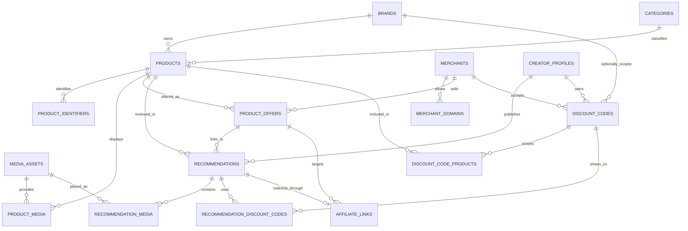
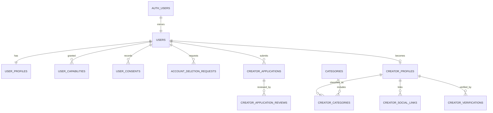
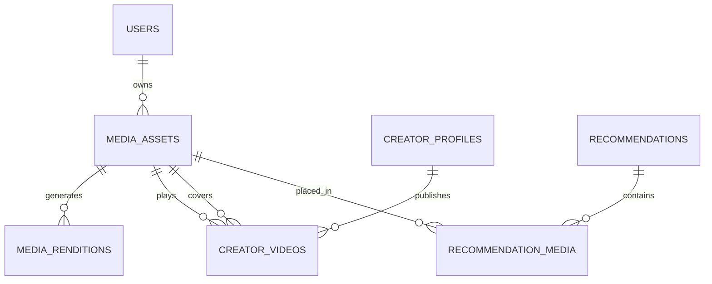
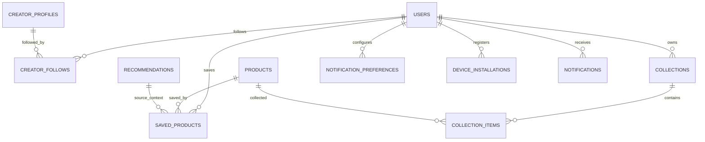
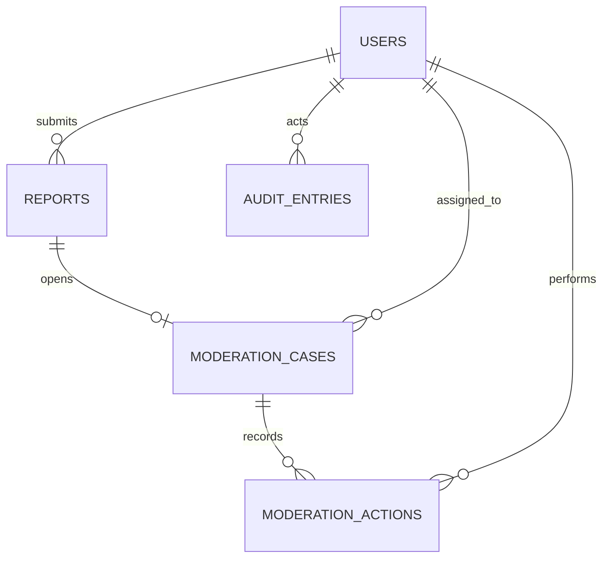
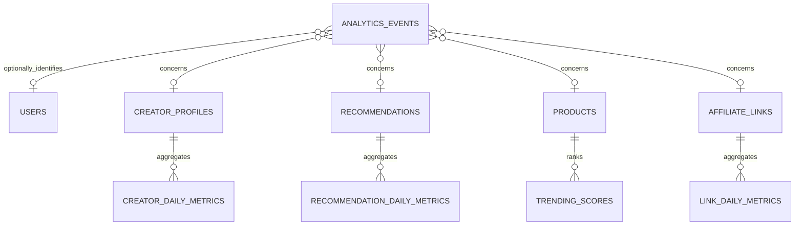

# Swave data model and ERD

**Status:** Accepted baseline

**Date:** 2026-08-06

## 1. Goals

The data model must support:

- one account that can browse, save, follow, and later gain approved creator capabilities
- reviewed creator applications and independently controlled verification
- shared canonical products recommended by many creators
- merchant-specific prices, availability, and outbound URLs
- creator-specific Hebrew reviews, story clips, codes, and attribution
- standalone creator videos and recommendation-attached clips
- code and price freshness rather than unsupported guarantees
- public feeds, search, trending, moderation, reports, and creator analytics
- anonymous browsing with privacy-conscious interaction measurement
- account export, deletion, auditability, and asynchronous processing

PostgreSQL is the source of truth. Search documents, public feed projections, aggregates, thumbnails, and provider assets are derived and rebuildable.

## 2. Database schema boundaries

| Schema      | Purpose                                              | Direct client access                        |
| ----------- | ---------------------------------------------------- | ------------------------------------------- |
| `auth`      | Supabase-managed identities and sessions             | Through Supabase Auth only                  |
| `storage`   | Supabase-managed object metadata                     | Through storage policies and signed uploads |
| `app`       | Transactional Swave domain data                   | No; API owns access                         |
| `analytics` | Raw business events and daily aggregates             | No; API/worker owns access                  |
| `audit`     | Immutable privileged-action history                  | No; restricted staff access through API     |
| `ops`       | Outbox, webhook receipts, imports, jobs, idempotency | No; API/worker only                         |
| `search`    | Rebuildable search documents and normalization       | No; discovery module only                   |
| `public`    | Kept free of application tables                      | No exposed application schema by default    |

Supabase's `anon` and `authenticated` database roles receive no general grants on `app`, `analytics`, `audit`, `ops`, or `search`. Direct client operations are limited to Supabase Auth and explicitly authorized storage uploads. Core reads and writes use the Swave API.

## 3. Identifier and column conventions

- Public domain records use UUID primary keys.
- The application generates time-ordered UUIDs where supported; `gen_random_uuid()` is the portable fallback.
- Supabase identity records and `app.users` share the same UUID.
- High-volume append-only analytics rows may use a generated UUID plus time partitioning.
- External URLs are stored with a normalized form and a SHA-256 hash for indexing and deduplication.
- Timestamps use `timestamptz` and are interpreted as UTC.
- Money uses `numeric(12,2)` plus an uppercase ISO 4217 `char(3)` currency.
- User-visible order uses integer `position` values with deterministic UUID tie-breaking.
- Flexible metadata is JSONB only when its attributes are provider-specific or not queried as core domain fields.
- Lifecycle values use `text` plus check constraints rather than PostgreSQL enums, allowing safer staged changes.
- Every mutable aggregate includes `created_at`, `updated_at`, and an integer `version` for optimistic concurrency.
- Recoverable public content uses `deleted_at`; pure join rows are hard-deleted.

## 4. Core catalog and recommendation ERD

### 4.1 `app.categories`

Hierarchical discovery categories.

| Column                     | Type          | Notes                                   |
| -------------------------- | ------------- | --------------------------------------- |
| `id`                       | uuid          | Primary key                             |
| `parent_id`                | uuid nullable | Self-reference; restricted deletion     |
| `slug`                     | citext        | Unique public slug                      |
| `name_en`                  | text          | Required English interface name         |
| `description_he`           | text nullable | Hebrew editorial copy                   |
| `cover_media_id`           | uuid nullable | Approved image                          |
| `status`                   | text          | `draft`, `active`, `hidden`, `archived` |
| `position`                 | integer       | Editorial ordering                      |
| `created_at`, `updated_at` | timestamptz   | Audit timestamps                        |

Constraints and indexes:

- unique `slug`
- check normalized slug format
- index `(status, position, id)`
- prevent direct parent cycles through service validation and a database trigger

### 4.2 `app.brands`

Canonical brand identity.

| Column                     | Type          | Notes                          |
| -------------------------- | ------------- | ------------------------------ |
| `id`                       | uuid          | Primary key                    |
| `slug`                     | citext        | Unique public slug             |
| `name`                     | text          | Display name                   |
| `normalized_name`          | text          | Deduplication/search value     |
| `website_url`              | text nullable | Validated HTTPS URL            |
| `logo_media_id`            | uuid nullable | Approved media                 |
| `status`                   | text          | `active`, `merged`, `archived` |
| `merged_into_id`           | uuid nullable | Canonical replacement          |
| `created_at`, `updated_at` | timestamptz   | Audit timestamps               |

Brand merging updates references transactionally and preserves an alias record rather than silently deleting duplicate identity.

### 4.3 `app.merchants`

External retailers that sell products.

| Column                     | Type          | Notes                                        |
| -------------------------- | ------------- | -------------------------------------------- |
| `id`                       | uuid          | Primary key                                  |
| `slug`                     | citext        | Unique public identifier                     |
| `name`                     | text          | Display name                                 |
| `homepage_url`             | text          | Validated HTTPS homepage                     |
| `import_adapter_key`       | text nullable | Versioned adapter identifier                 |
| `affiliate_provider`       | text nullable | Provider key, not credentials                |
| `status`                   | text          | `pending`, `active`, `suspended`, `archived` |
| `created_at`, `updated_at` | timestamptz   | Audit timestamps                             |

Credentials and secrets are stored in managed secret infrastructure, never in this table.

### 4.4 `app.merchant_domains`

Normalized domains used by import and redirect allowlists.

| Column                     | Type                 | Notes                                         |
| -------------------------- | -------------------- | --------------------------------------------- |
| `id`                       | uuid                 | Primary key                                   |
| `merchant_id`              | uuid                 | Merchant foreign key                          |
| `hostname`                 | citext               | ASCII-normalized hostname                     |
| `allow_import`             | boolean              | Product importer permission                   |
| `allow_redirect`           | boolean              | Outbound-link permission                      |
| `review_status`            | text                 | `pending`, `approved`, `rejected`, `disabled` |
| `verified_at`              | timestamptz nullable | Domain ownership/relationship check           |
| `reviewed_by_user_id`      | uuid nullable        | Administrator who made the latest decision    |
| `reviewed_at`              | timestamptz nullable | Latest decision time                          |
| `review_note`              | text nullable        | Private bounded verification or denial note   |
| `created_at`, `updated_at` | timestamptz          | Audit timestamps                              |
| `version`                  | integer              | Optimistic concurrency                        |

Unique normalized `hostname`; redirects are checked after every redirect hop. A
creator can only create a pending row. Approval, rejection, reapproval, and
disabling are administrator decisions recorded in `audit.entries`.

### 4.5 `app.products`

Canonical product independent of creator and merchant.

| Column                                   | Type          | Notes                                              |
| ---------------------------------------- | ------------- | -------------------------------------------------- |
| `id`                                     | uuid          | Primary key                                        |
| `slug`                                   | citext        | Stable public slug with uniqueness suffix          |
| `brand_id`                               | uuid nullable | Canonical brand                                    |
| `primary_category_id`                    | uuid          | Primary category                                   |
| `name`                                   | text          | Canonical display name                             |
| `normalized_name`                        | text          | Search/deduplication value                         |
| `description`                            | text nullable | Merchant/editorial description, not creator review |
| `status`                                 | text          | `candidate`, `active`, `merged`, `archived`        |
| `merged_into_id`                         | uuid nullable | Canonical replacement                              |
| `created_by_user_id`                     | uuid nullable | Import/manual provenance                           |
| `created_at`, `updated_at`, `deleted_at` | timestamptz   | Lifecycle timestamps                               |
| `version`                                | integer       | Optimistic concurrency                             |

Indexes:

- unique active `slug`
- `(primary_category_id, status, id)`
- `(brand_id, status, id)`
- trigram index on `normalized_name`
- partial index for active non-deleted products

Products with published recommendations are archived or merged, not hard-deleted.

### 4.6 `app.product_identifiers`

GTIN, EAN, UPC, MPN, merchant SKU, or another external identifier.

| Column        | Type          | Notes                                       |
| ------------- | ------------- | ------------------------------------------- |
| `id`          | uuid          | Primary key                                 |
| `product_id`  | uuid          | Product foreign key                         |
| `merchant_id` | uuid nullable | Required for merchant-scoped SKU            |
| `kind`        | text          | `gtin`, `ean`, `upc`, `mpn`, `sku`, `other` |
| `value`       | text          | Normalized identifier                       |
| `created_at`  | timestamptz   | Audit timestamp                             |

Uniqueness is `(kind, value)` for global identifiers and `(merchant_id, kind, value)` for merchant-scoped identifiers.

### 4.7 `app.product_offers`

Merchant-specific purchase destination and observed commercial state.

| Column                                   | Type                   | Notes                                                             |
| ---------------------------------------- | ---------------------- | ----------------------------------------------------------------- |
| `id`                                     | uuid                   | Primary key                                                       |
| `product_id`                             | uuid                   | Product foreign key                                               |
| `merchant_id`                            | uuid                   | Merchant foreign key                                              |
| `canonical_url`                          | text                   | Validated HTTPS URL                                               |
| `canonical_url_hash`                     | bytea                  | SHA-256 normalized URL hash                                       |
| `price_amount`                           | numeric(12,2) nullable | Observed price                                                    |
| `currency`                               | char(3) nullable       | Required when price is present                                    |
| `availability`                           | text                   | `unknown`, `in_stock`, `out_of_stock`, `preorder`, `discontinued` |
| `price_source`                           | text                   | `merchant_page`, `feed`, `api`, `creator`, `staff`                |
| `observed_at`                            | timestamptz nullable   | Freshness timestamp                                               |
| `status`                                 | text                   | `active`, `stale`, `blocked`, `archived`                          |
| `created_at`, `updated_at`, `deleted_at` | timestamptz            | Lifecycle timestamps                                              |
| `version`                                | integer                | Optimistic concurrency                                            |

Constraints and indexes:

- unique active `canonical_url_hash`
- price and currency must either both be present or both absent
- non-negative price
- `(product_id, status, observed_at desc)`
- `(merchant_id, status, observed_at desc)`

### 4.8 `app.recommendations`

The creator-owned review and storefront placement.

| Column                                   | Type                   | Notes                                                        |
| ---------------------------------------- | ---------------------- | ------------------------------------------------------------ |
| `id`                                     | uuid                   | Primary key                                                  |
| `creator_id`                             | uuid                   | Creator profile foreign key                                  |
| `product_id`                             | uuid                   | Canonical product foreign key                                |
| `offer_id`                               | uuid                   | Selected merchant offer                                      |
| `review_text`                            | text                   | Full creator review                                          |
| `review_locale`                          | text                   | Initially `he`                                               |
| `creator_price_amount`                   | numeric(12,2) nullable | Explicit creator-entered price override                      |
| `creator_price_currency`                 | char(3) nullable       | Required with override                                       |
| `commercial_relationship`                | text                   | `none`, `affiliate`, `gifted`, `sponsored`, `other`          |
| `lifecycle_status`                       | text                   | `draft`, `submitted`, `published`, `rejected`, `archived`    |
| `moderation_status`                      | text                   | `not_required`, `pending`, `approved`, `rejected`, `blocked` |
| `position`                               | integer                | Creator storefront ordering                                  |
| `published_at`                           | timestamptz nullable   | Public ordering cursor                                       |
| `created_at`, `updated_at`, `deleted_at` | timestamptz            | Lifecycle timestamps                                         |
| `version`                                | integer                | Optimistic concurrency                                       |

Constraints and indexes:

- review length is bounded in characters, not display lines
- price and currency pairing constraint
- one non-archived recommendation per creator and product by partial unique index
- partial feed index `(creator_id, published_at desc, id desc)` for published rows
- partial index `(product_id, published_at desc, id desc)` for product aggregation
- publication requires approved/allowed moderation, active creator, product, offer, and destination

### 4.9 `app.affiliate_links`

Tracked outbound destination controlled by Swave.

| Column                     | Type                 | Notes                                        |
| -------------------------- | -------------------- | -------------------------------------------- |
| `id`                       | uuid                 | Internal primary key                         |
| `public_id`                | uuid                 | Non-sequential redirect identifier           |
| `recommendation_id`        | uuid                 | Owning recommendation                        |
| `offer_id`                 | uuid                 | Target offer                                 |
| `destination_url`          | text                 | Validated HTTPS destination                  |
| `destination_url_hash`     | bytea                | Normalized hash                              |
| `provider`                 | text nullable        | Affiliate-network key                        |
| `provider_reference`       | text nullable        | External tracking reference                  |
| `status`                   | text                 | `active`, `unhealthy`, `blocked`, `archived` |
| `last_checked_at`          | timestamptz nullable | Health timestamp                             |
| `created_at`, `updated_at` | timestamptz          | Audit timestamps                             |
| `version`                  | integer              | Optimistic concurrency                       |

Unique `public_id`; one active link per recommendation; redirect reads use a covering partial index on active `public_id`.

### 4.10 Discount-code tables

`app.discount_codes` stores the code's identity and broad scope.

| Column                                   | Type                 | Notes                                                                                        |
| ---------------------------------------- | -------------------- | -------------------------------------------------------------------------------------------- |
| `id`                                     | uuid                 | Primary key                                                                                  |
| `creator_id`                             | uuid                 | Creator owner                                                                                |
| `merchant_id`                            | uuid                 | Accepting merchant                                                                           |
| `brand_id`                               | uuid nullable        | Optional brand scope                                                                         |
| `code`                                   | citext               | Original value preserved; case-insensitive matching                                          |
| `label`                                  | text nullable        | Example: `15% off`                                                                           |
| `details_text`                           | text nullable        | Creator terms/details                                                                        |
| `details_locale`                         | text                 | Initially `he`                                                                               |
| `starts_at`, `expires_at`                | timestamptz nullable | Validity window                                                                              |
| `verification_status`                    | text                 | `unverified`, `creator_confirmed`, `staff_confirmed`, `merchant_verified`, `failed`, `stale` |
| `last_verified_at`                       | timestamptz nullable | Freshness timestamp                                                                          |
| `lifecycle_status`                       | text                 | `draft`, `submitted`, `published`, `hidden`, `expired`, `archived`                           |
| `created_at`, `updated_at`, `deleted_at` | timestamptz          | Lifecycle timestamps                                                                         |
| `version`                                | integer              | Optimistic concurrency                                                                       |

Supporting tables:

- `app.discount_code_products(code_id, product_id)` for explicit product scope
- `app.recommendation_discount_codes(recommendation_id, code_id, position)` for card placement
- `app.discount_code_verifications(id, code_id, method, result, checked_by_user_id, evidence, checked_at)` for immutable verification history

Indexes cover active codes by creator, merchant, expiry, and verification freshness. Publication logic prevents expired codes from appearing active.

## 5. Identity and creator ERD

### 5.1 `app.users`

One-to-one platform account mirror of `auth.users`.

| Column                                   | Type                 | Notes                                                |
| ---------------------------------------- | -------------------- | ---------------------------------------------------- |
| `id`                                     | uuid                 | Primary key and `auth.users.id` foreign key          |
| `status`                                 | text                 | `active`, `suspended`, `deletion_pending`, `deleted` |
| `last_active_at`                         | timestamptz nullable | Coarse account activity                              |
| `created_at`, `updated_at`, `deleted_at` | timestamptz          | Lifecycle timestamps                                 |
| `version`                                | integer              | Optimistic concurrency                               |

Authentication provider details remain in `auth`; application authorization never depends on editable profile fields.

### 5.2 `app.user_profiles`

| Column                     | Type          | Notes                               |
| -------------------------- | ------------- | ----------------------------------- |
| `user_id`                  | uuid          | Primary key                         |
| `display_name`             | text          | Shopper-facing display value        |
| `avatar_media_id`          | uuid nullable | Approved image                      |
| `interface_locale`         | text          | Initially `en`                      |
| `timezone`                 | text          | IANA zone, default `Asia/Jerusalem` |
| `created_at`, `updated_at` | timestamptz   | Audit timestamps                    |
| `version`                  | integer       | Optimistic concurrency              |

### 5.3 `app.user_capabilities`

Server-controlled grants such as `creator`, `moderator`, and `administrator`. Shopper behavior is the default authenticated capability and does not require a grant row.

| Column               | Type                 | Notes                       |
| -------------------- | -------------------- | --------------------------- |
| `user_id`            | uuid                 | Account foreign key         |
| `capability`         | text                 | Controlled capability value |
| `granted_by_user_id` | uuid nullable        | Staff actor/system          |
| `granted_at`         | timestamptz          | Grant time                  |
| `revoked_at`         | timestamptz nullable | Revocation time             |
| `reason`             | text nullable        | Audit context               |

Partial uniqueness allows at most one active grant per user and capability.

`app.user_consents` separately records consent or acknowledgement type, policy/document version, grant or withdrawal time, collection surface, and evidence metadata. Updating a user preference never overwrites the historical fact that a specific terms or privacy version was accepted.

### 5.4 `app.creator_applications`

| Column                       | Type                 | Notes                                                                                          |
| ---------------------------- | -------------------- | ---------------------------------------------------------------------------------------------- |
| `id`                         | uuid                 | Primary key                                                                                    |
| `user_id`                    | uuid                 | Applicant                                                                                      |
| `requested_handle`           | citext               | Desired storefront handle                                                                      |
| `display_name`               | text                 | Proposed creator name                                                                          |
| `bio_text`                   | text                 | Hebrew bio                                                                                     |
| `bio_locale`                 | text                 | Initially `he`                                                                                 |
| `primary_category_id`        | uuid                 | Requested category                                                                             |
| `status`                     | text                 | `draft`, `submitted`, `under_review`, `changes_requested`, `approved`, `rejected`, `withdrawn` |
| `submitted_at`, `decided_at` | timestamptz nullable | Workflow timestamps                                                                            |
| `created_at`, `updated_at`   | timestamptz          | Audit timestamps                                                                               |
| `version`                    | integer              | Optimistic concurrency                                                                         |

Application social evidence is stored in `app.creator_application_social_links`; private staff notes are stored in review records and never returned through applicant DTOs.

### 5.5 `app.creator_application_reviews`

Immutable decision history.

| Column             | Type          | Notes                                                  |
| ------------------ | ------------- | ------------------------------------------------------ |
| `id`               | uuid          | Primary key                                            |
| `application_id`   | uuid          | Application foreign key                                |
| `reviewer_user_id` | uuid          | Moderator/admin                                        |
| `decision`         | text          | `started`, `changes_requested`, `approved`, `rejected` |
| `public_message`   | text nullable | Applicant-visible feedback                             |
| `private_notes`    | text nullable | Staff-only                                             |
| `created_at`       | timestamptz   | Decision time                                          |

### 5.6 `app.creator_profiles`

| Column                                   | Type                 | Notes                                                    |
| ---------------------------------------- | -------------------- | -------------------------------------------------------- |
| `id`                                     | uuid                 | Primary key                                              |
| `user_id`                                | uuid                 | Unique account foreign key                               |
| `handle`                                 | citext               | Unique public handle                                     |
| `display_name`                           | text                 | Public creator name                                      |
| `bio_text`                               | text                 | Hebrew bio                                               |
| `bio_locale`                             | text                 | Initially `he`                                           |
| `primary_category_id`                    | uuid                 | Primary discovery category                               |
| `avatar_media_id`                        | uuid nullable        | Approved media                                           |
| `verification_status`                    | text                 | `unverified`, `pending`, `verified`, `revoked`           |
| `publication_status`                     | text                 | `draft`, `pending`, `published`, `suspended`, `archived` |
| `trust_tier`                             | text                 | `new`, `standard`, `trusted`, `restricted`               |
| `published_at`                           | timestamptz nullable | Storefront publication time                              |
| `created_at`, `updated_at`, `deleted_at` | timestamptz          | Lifecycle timestamps                                     |
| `version`                                | integer              | Optimistic concurrency                                   |

Indexes:

- unique active lowercase `handle`
- handle format and reserved-word checks
- partial public index `(publication_status, published_at desc, id desc)`
- `(primary_category_id, publication_status, published_at desc, id desc)`

### 5.7 Creator classification and trust history

- `app.creator_categories(creator_id, category_id, is_primary, position)` supports multiple categories with exactly one primary category enforced by a partial unique index.
- `app.creator_social_links(id, creator_id, platform, handle, url, follower_count, verified_at, position)` stores public social identity without making follower counts authoritative ranking inputs by themselves.
- `app.creator_verifications(id, creator_id, status, method, verified_by_user_id, evidence_reference, created_at)` stores immutable verification history; sensitive evidence is stored outside public tables.

## 6. Media ERD

### 6.1 `app.media_assets`

| Column                                   | Type             | Notes                                                                                |
| ---------------------------------------- | ---------------- | ------------------------------------------------------------------------------------ |
| `id`                                     | uuid             | Primary key                                                                          |
| `owner_user_id`                          | uuid             | Uploader/owner                                                                       |
| `media_type`                             | text             | `image`, `video`                                                                     |
| `purpose`                                | text             | `avatar`, `product`, `story`, `video_cover`, `category_cover`, `brand_logo`, `other` |
| `source`                                 | text             | `upload`, `merchant_feed`, `merchant_page`, `staff`, `provider`                      |
| `provider`                               | text             | `supabase`, `mux`, or approved provider                                              |
| `provider_asset_id`                      | text nullable    | External management identifier                                                       |
| `provider_playback_id`                   | text nullable    | Public/signed playback identifier                                                    |
| `object_key`                             | text nullable    | Storage key, never public bucket credentials                                         |
| `mime_type`                              | text             | Validated MIME type                                                                  |
| `byte_size`                              | bigint nullable  | Non-negative size                                                                    |
| `width`, `height`                        | integer nullable | Pixel dimensions                                                                     |
| `duration_ms`                            | integer nullable | Video duration                                                                       |
| `checksum_sha256`                        | bytea nullable   | Deduplication/integrity                                                              |
| `rights_source`                          | text nullable    | Usage provenance                                                                     |
| `original_source_url`                    | text nullable    | External provenance                                                                  |
| `processing_status`                      | text             | `pending_upload`, `uploaded`, `processing`, `ready`, `failed`, `deleted`             |
| `moderation_status`                      | text             | `pending`, `approved`, `rejected`, `blocked`                                         |
| `created_at`, `updated_at`, `deleted_at` | timestamptz      | Lifecycle timestamps                                                                 |
| `version`                                | integer          | Optimistic concurrency                                                               |

Provider secrets, signed URLs, and temporary upload URLs are never persisted as public media fields.

### 6.2 `app.media_renditions`

Generated image or preview variants.

| Column            | Type        | Notes                                                              |
| ----------------- | ----------- | ------------------------------------------------------------------ |
| `id`              | uuid        | Primary key                                                        |
| `media_asset_id`  | uuid        | Parent asset                                                       |
| `kind`            | text        | `thumbnail`, `card`, `detail`, `avatar`, `story_cover`, `original` |
| `object_key`      | text        | Provider storage key                                               |
| `format`          | text        | `avif`, `webp`, `jpeg`, `png`                                      |
| `width`, `height` | integer     | Pixel dimensions                                                   |
| `byte_size`       | bigint      | Size                                                               |
| `status`          | text        | `processing`, `ready`, `failed`, `deleted`                         |
| `created_at`      | timestamptz | Audit timestamp                                                    |

Unique `(media_asset_id, kind, format, width)` prevents duplicate variants.

### 6.3 Placement tables

- `app.product_media(product_id, media_asset_id, role, position)` places approved product media.
- `app.recommendation_media(recommendation_id, media_asset_id, role, position)` places story clips or creator-owned supporting images.
- `app.creator_videos(id, creator_id, video_media_id, cover_media_id, title, caption_text, caption_locale, lifecycle_status, moderation_status, position, published_at, timestamps)` represents standalone video previews.

Deleting placement does not immediately delete a shared asset. Asset deletion occurs only after reference checks and provider cleanup.

## 7. Shopper and notification ERD

### Core tables

- `app.creator_follows(user_id, creator_id, created_at)` with unique `(user_id, creator_id)` and reverse index `(creator_id, created_at)`.
- `app.saved_products(user_id, product_id, source_recommendation_id, created_at)` with unique `(user_id, product_id)`.
- `app.collections(id, user_id, name, visibility, position, timestamps)`; visibility is private in the first release.
- `app.collection_items(collection_id, product_id, source_recommendation_id, position, created_at)`.
- `app.device_installations(id, user_id, platform, push_token_ciphertext, app_version, last_seen_at, revoked_at)`; push tokens are encrypted and never logged.
- `app.notification_preferences(user_id, type, channel, enabled, quiet_hours, updated_at)`.
- `app.notifications(id, user_id, type, title, body, deep_link, data, created_at, read_at, expires_at)`.

Counts such as follower totals and save totals are derived counters, not updated through unprotected client arithmetic.

## 8. Moderation and reporting ERD

### 8.1 `app.reports`

Reports preserve foreign keys without a generic polymorphic target. Nullable target columns include:

- `creator_id`
- `product_id`
- `recommendation_id`
- `discount_code_id`
- `media_asset_id`

A `num_nonnulls(...) = 1` constraint requires exactly one target.

Other fields include reporter, reason code, description, status, created time, resolution time, and deduplication fingerprint. Reporter identity is staff-visible only.

### 8.2 `app.moderation_cases`

Cases use the same exactly-one-target pattern and include status, priority, assigned staff user, source, opened time, and resolved time. A report may open or attach to a case.

### 8.3 `app.moderation_actions`

Immutable actions include:

- assign
- approve
- reject
- request changes
- hide
- restore
- suspend creator
- revoke verification
- block media
- resolve report

Each action records case, staff actor, reason, public note, private note, metadata, and timestamp.

### 8.4 `audit.entries`

Append-only privileged-action history:

| Column                      | Type           | Notes                                            |
| --------------------------- | -------------- | ------------------------------------------------ |
| `id`                        | uuid           | Primary key                                      |
| `occurred_at`               | timestamptz    | Partition/order key                              |
| `actor_user_id`             | uuid nullable  | Null after permitted anonymization/system action |
| `action`                    | text           | Stable action name                               |
| `entity_type`               | text           | Domain entity type                               |
| `entity_id`                 | uuid nullable  | Target identifier                                |
| `request_id`                | uuid nullable  | Trace correlation                                |
| `before_data`, `after_data` | jsonb nullable | Redacted snapshots                               |
| `metadata`                  | jsonb          | Non-secret context                               |

Audit rows cannot be updated or deleted by application roles. Sensitive values, tokens, raw passwords, full IP addresses, and secrets are never written to audit JSON.

## 9. Analytics ERD

### 9.1 `analytics.events`

Monthly partitioned append-only business events.

Target UUID columns in the raw event table are intentionally denormalized and do not use cascading foreign keys. This allows bounded analytical retention and permitted anonymization after a domain record is deleted without making transactional deletion depend on old event partitions. Ingestion validates known identifiers before acceptance; aggregates use current domain visibility rules.

| Column              | Type           | Notes                                        |
| ------------------- | -------------- | -------------------------------------------- |
| `id`                | uuid           | Event identifier                             |
| `event_name`        | text           | Stable registered name                       |
| `schema_version`    | smallint       | Payload version                              |
| `occurred_at`       | timestamptz    | Client/server event time                     |
| `received_at`       | timestamptz    | Server ingestion time                        |
| `user_id`           | uuid nullable  | Authenticated account                        |
| `anonymous_id_hash` | bytea nullable | Rotatable pseudonymous identifier            |
| `session_id`        | uuid nullable  | Session correlation                          |
| `creator_id`        | uuid nullable  | Denormalized target                          |
| `recommendation_id` | uuid nullable  | Denormalized target                          |
| `product_id`        | uuid nullable  | Denormalized target                          |
| `affiliate_link_id` | uuid nullable  | Denormalized target                          |
| `source`            | text           | `web`, `ios`, `android`, `server`, `partner` |
| `properties`        | jsonb          | Versioned non-sensitive attributes           |
| `deduplication_key` | text nullable  | Idempotent external event key                |

Indexes:

- BRIN on `occurred_at` per large partition
- B-tree on `(creator_id, occurred_at)` and other measured aggregation keys
- unique source/deduplication key where present
- no broad GIN index on arbitrary properties without a measured query

Raw event retention is bounded. Creator dashboards read aggregates rather than scanning this table.

### 9.2 Aggregate tables

- `analytics.creator_daily_metrics(creator_id, metric_date, storefront_views, unique_visitors, recommendation_views, product_saves, story_opens, story_completions, code_copies, shop_clicks, social_clicks, updated_at)`.
- `analytics.recommendation_daily_metrics(recommendation_id, metric_date, views, unique_viewers, saves, story_opens, story_completions, code_copies, shop_clicks, updated_at)`.
- `analytics.link_daily_metrics(affiliate_link_id, metric_date, clicks, unique_clickers, unhealthy_attempts, updated_at)`.
- `analytics.trending_scores(product_id, window, score, components, computed_at)`.

Primary keys combine entity ID and metric date/window. Workers use idempotent upserts from event checkpoints.

## 10. Operations and reliable delivery

### 10.1 `ops.outbox_events`

Domain changes and their asynchronous side effects are committed atomically.

| Column           | Type                 | Notes                            |
| ---------------- | -------------------- | -------------------------------- |
| `id`             | uuid                 | Event and idempotency identifier |
| `topic`          | text                 | Stable event topic               |
| `schema_version` | smallint             | Payload version                  |
| `aggregate_type` | text                 | Domain owner                     |
| `aggregate_id`   | uuid                 | Domain record                    |
| `payload`        | jsonb                | Minimal event data               |
| `occurred_at`    | timestamptz          | Domain event time                |
| `available_at`   | timestamptz          | Earliest dispatch                |
| `dispatched_at`  | timestamptz nullable | Successful queue publication     |
| `attempt_count`  | integer              | Dispatch attempts                |
| `last_error`     | text nullable        | Redacted failure summary         |

The API writes state and outbox event in one transaction. A dispatcher publishes the event to Cloud Tasks and marks it dispatched. Consumers remain idempotent because dispatch can occur more than once.

### 10.2 Other operational tables

- `ops.idempotency_keys(scope, key_hash, user_id, request_hash, response_status, response_body, expires_at)` for retry-safe API commands.
- `ops.webhook_receipts(provider, provider_event_id, payload_hash, received_at, processed_at, status, attempt_count, last_error)` for replay protection.
- `ops.product_import_attempts(id, requested_by_user_id, source_url, normalized_url, state, adapter_key, product_id, offer_id, extraction_data, error_code, timestamps)`.
- `ops.link_health_checks(id, affiliate_link_id, checked_at, result, http_status, final_hostname, latency_ms, error_code)`.
- `ops.job_executions(id, job_type, job_version, idempotency_key, state, attempt, started_at, finished_at, error_code, trace_id)`.
- `ops.account_deletion_requests(id, user_id, state, requested_at, scheduled_at, completed_at, failure_reason)`.

Operational error fields store stable codes and redacted summaries rather than third-party response bodies that may contain secrets or personal data.

## 11. Search documents

`search.documents` is a rebuildable projection.

| Column              | Type          | Notes                                     |
| ------------------- | ------------- | ----------------------------------------- |
| `entity_type`       | text          | `creator`, `product`, `brand`, `category` |
| `entity_id`         | uuid          | Source record                             |
| `locale`            | text          | Search document locale                    |
| `title`             | text          | Primary display/search value              |
| `subtitle`          | text nullable | Secondary value                           |
| `body`              | text          | Normalized searchable content             |
| `keywords`          | text[]        | Alternate spellings/tags                  |
| `category_ids`      | uuid[]        | Filtering projection                      |
| `popularity_score`  | numeric       | Derived ranking input                     |
| `search_vector`     | tsvector      | PostgreSQL full-text document             |
| `source_updated_at` | timestamptz   | Projection freshness                      |
| `indexed_at`        | timestamptz   | Build time                                |

Primary key `(entity_type, entity_id, locale)`. GIN index on `search_vector`, trigram indexes on normalized title fields, and measured filter indexes. If Algolia is added, this table remains the provider-neutral export source.

## 12. Module ownership map

| Module               | Owned tables                                                                                  |
| -------------------- | --------------------------------------------------------------------------------------------- |
| Identity             | users, user_profiles, user_capabilities, user_consents                                        |
| Creator applications | creator_applications, application social links, application reviews                           |
| Creators             | creator_profiles, creator_categories, creator_social_links, creator_verifications             |
| Catalog              | categories, brands, merchants, merchant_domains, products, identifiers, offers, product_media |
| Recommendations      | recommendations, recommendation_media, recommendation_discount_codes                          |
| Discounts            | discount_codes, code products, code verifications                                             |
| Media                | media_assets, media_renditions, creator_videos                                                |
| Social               | creator_follows, saved_products, collections, collection_items                                |
| Affiliate links      | affiliate_links, link health checks                                                           |
| Analytics            | raw events, daily metrics, trending scores                                                    |
| Moderation           | reports, cases, actions                                                                       |
| Notifications        | preferences, device installations, notifications                                              |
| Operations           | outbox, idempotency, webhooks, imports, jobs, deletion requests                               |
| Audit                | audit entries                                                                                 |
| Discovery            | search documents and public read projections                                                  |

Only the owning module writes its tables. Other modules use an exported service, query interface, or domain event. Cross-module database foreign keys preserve integrity but do not grant arbitrary write ownership.

## 13. Foreign-key deletion policy

| Parent            | Child behavior                                                                  |
| ----------------- | ------------------------------------------------------------------------------- |
| Auth user deleted | Account enters deletion workflow before auth identity removal                   |
| User profile      | Cascade after export/retention workflow                                         |
| Creator profile   | Archive public content; do not silently cascade published recommendations       |
| Product           | Restrict deletion; merge or archive if referenced                               |
| Offer             | Restrict while active recommendation links exist                                |
| Recommendation    | Soft-delete/archive; placements and code joins can cascade after retention      |
| Media asset       | Restrict while referenced; cleanup workflow removes provider asset              |
| Discount code     | Archive; verification history retained                                          |
| Analytics target  | Raw events retain opaque target UUID after domain deletion where policy permits |
| Audit actor       | Set null/anonymize when legally permitted; audit action remains                 |

Hard cascading is reserved for owned join rows and private subordinate records. Public or audited records use explicit lifecycle transitions.

## 14. Row-level security strategy

The HTTP API is the primary authorization boundary, but database privileges and RLS provide defense in depth.

- Revoke default table access from `anon` and `authenticated` for private schemas.
- Enable RLS on any table exposed through a Supabase API schema.
- Storage policies allow an authenticated user to upload only beneath an authorized temporary owner path and within MIME/size constraints.
- The API database role receives only the privileges required by its modules.
- The worker role can process operational tables and explicitly required domain tables.
- The analytics writer cannot read sensitive identity fields.
- The moderator API never receives unrestricted direct SQL access from a client.
- The migration owner is not used by runtime services.

RLS policies and grants are tested as database behavior, not assumed from application tests.

## 15. Required constraints

The initial migrations must enforce at least:

- lowercase/normalized creator handles and category/brand slugs
- reserved-handle exclusion
- non-empty trimmed names and Hebrew content bounds
- money/currency pairing and non-negative amounts
- start date before expiration date
- exactly one report/moderation target
- one active capability grant per user/capability
- one active follow and save relation
- one active recommendation per creator/product
- one primary creator category
- active affiliate-link destination tied to an allowed merchant domain
- published records have `published_at`
- deleted records cannot remain published
- verification timestamps are compatible with verification state
- media dimensions, duration, and byte sizes are non-negative
- positions are non-negative

State-transition rules that depend on several aggregates are enforced transactionally in the domain service and backed by the strongest practical local database constraints.

## 16. Initial index plan

Indexes are added for known access paths, then validated with production query plans.

### Public reads

- published creators by category and publication cursor
- recommendations by creator and publication cursor
- recommendations by product and publication cursor
- active offers by product and freshness
- active codes by creator, expiry, and verification freshness
- active affiliate link by public redirect ID

### Authenticated reads

- saves by user and created cursor
- follows by user and created cursor
- creator follower count reverse index
- creator dashboard content by lifecycle status and update cursor
- moderation queue by status, priority, and opened cursor

### Operations

- undispatched outbox events by availability
- pending import attempts by state/update time
- webhook receipt uniqueness by provider/event ID
- due code and link checks by next-check time
- deletion requests by scheduled time

### Analytics/search

- partition and BRIN indexes for event time
- aggregation keys based on measured worker queries
- GIN full-text indexes and targeted trigram indexes

Avoid indexing every foreign key or JSON property automatically; indexes are justified by integrity requirements or measured query paths.

## 17. Public read projections

The UI screenshots need card-shaped data that would otherwise require wide joins. The discovery module maintains rebuildable projections such as:

- `creator_card_view`
- `creator_storefront_header_view`
- `recommendation_card_view`
- `product_aggregate_card_view`
- `category_card_view`
- `trending_product_view`

These projections include only public, approved fields and precomputed creator avatars, recommendation counts, visible code state, story availability, current offer, and freshness labels. They never expose staff notes, private user data, provider secrets, or raw moderation evidence.

The next architecture step defines the HTTP DTOs that consume these projections.
