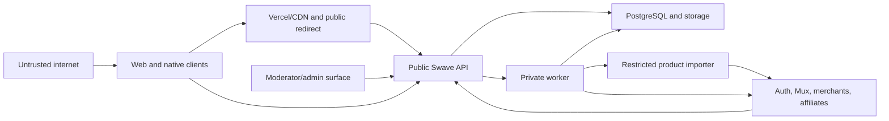

# Swave security boundaries

**Status:** Accepted baseline

**Date:** 2026-08-06

## 1. Security objectives

Swave must protect:

- shopper identity, private saves/follows, device tokens, and account rights
- creator identity, unpublished content, analytics, media, and commercial relationships
- staff moderation evidence and privileged operations
- affiliate destinations and attribution integrity
- merchant-import infrastructure from SSRF and hostile content
- public trust against impersonation, malicious links, fraudulent codes, and inappropriate media
- service credentials, provider webhooks, and production data

Security controls are part of the architecture and acceptance criteria, not a final pre-launch pass.

## 2. Trust zones

Boundary assumptions:

- Clients are untrusted even when authenticated.
- Creator-supplied URLs, text, images, and videos are untrusted.
- Merchant pages and redirects are hostile until validated.
- Provider webhooks are untrusted until their signatures and replay constraints pass.
- Staff accounts reduce but do not eliminate risk; every privileged action is authorized and audited.
- Internal network location alone is not authentication.

## 3. Data classification

| Class        | Examples                                                                                | Baseline handling                                                 |
| ------------ | --------------------------------------------------------------------------------------- | ----------------------------------------------------------------- |
| Public       | Published creator profile, approved recommendation, public product                      | CDN/cache allowed; integrity controls                             |
| Internal     | Search ranking inputs, aggregate platform statistics, operational states                | Authenticated service/staff access                                |
| Confidential | Email, private saves/follows, creator analytics, application evidence                   | Encryption, least privilege, no public caches                     |
| Restricted   | Auth credentials, service secrets, device tokens, raw moderation evidence, export files | Managed secrets/encryption, narrow access, strict retention/audit |

Public data can still become sensitive when combined at scale. Bulk export and scraping controls are separate from per-record visibility.

## 4. Authentication boundary

- Supabase Auth establishes identity through approved providers.
- The API validates access tokens using trusted issuer keys and expected audience.
- Refresh/session handling follows web and native platform-appropriate storage.
- Web sessions use secure, HTTP-only, same-site cookies where server-managed cookies are used.
- Native refresh material uses platform secure storage, never ordinary async storage or logs.
- The app bundle contains no service-role, database, Mux secret, affiliate secret, or signing credential.
- Authentication provider identity does not grant creator/moderator/admin capability.
- Sensitive account changes and deletion require recent authentication or step-up verification.
- Sessions are revoked or blocked when account status becomes suspended or deletion-pending.

Sign-in error responses do not reveal whether a private email/account exists beyond the chosen authentication provider's safe behavior.

## 5. Authorization boundary

Every protected operation evaluates:

1. authenticated account state
2. required capability
3. resource ownership or staff scope
4. legal lifecycle transition
5. moderation/trust restrictions
6. optimistic concurrency/version

Controls:

- Deny by default.
- Do not trust creator/user IDs supplied in command bodies when they can be derived from identity.
- Query resources with ownership predicates rather than loading then forgetting to check.
- Return not found when revealing a private resource's existence is inappropriate.
- Staff endpoints use purpose-specific DTOs; `administrator` is not an unrestricted SQL interface.
- Database roles, grants, and RLS backstop the API boundary.
- Capability grant/revocation and verification changes are transactional and audited.

Object-level authorization tests cover horizontal and vertical privilege escalation for every mutable resource.

## 6. Web and API input security

- Parse only expected content types and bounded bodies.
- Validate DTOs with strict schemas; reject unknown sensitive fields to prevent mass assignment.
- Normalize Unicode where required for handles, URLs, search, and identifiers while preserving original display content.
- Bound strings, arrays, nesting, cursor length, and batch sizes.
- Store and render creator content as plain text unless a separately sanitized rich-text format is introduced.
- Encode output for HTML, URL, JSON, and attribute context.
- Use a restrictive Content Security Policy on web surfaces.
- Prevent framing of sensitive dashboard/admin pages.
- Use same-site/CSRF protections for cookie-authenticated mutations.
- Restrict CORS to approved web origins; native bearer-token requests do not justify wildcard credentialed CORS.
- Avoid state changes through GET requests.
- Use server-generated destinations and IDs rather than trusting return URLs.

Mixed Hebrew/English direction uses `dir`/logical layout attributes, not unsafe HTML injection.

## 7. Product importer isolation and SSRF defense

The product importer is a high-risk subsystem because creators submit arbitrary URLs that the server fetches.

### URL admission

- Accept `https` only.
- Parse with a standards-compliant URL parser; reject userinfo, malformed ports, fragments where irrelevant, and ambiguous encodings.
- Normalize hostname using IDNA rules and compare the ASCII form to the active merchant-domain allowlist.
- Reject raw IP destinations unless explicitly approved for a controlled integration.
- Reject nonstandard ports by default.
- Limit URL and query-string length.

### DNS and network controls

- Resolve all destination addresses before connecting.
- Reject loopback, private, link-local, multicast, carrier-grade NAT, reserved, documentation, and metadata-service ranges for IPv4 and IPv6.
- Repeat validation after every redirect and DNS resolution.
- Limit redirects and require every hostname to remain allowed.
- Run importer compute without access to private databases, control planes, metadata endpoints, internal service DNS, or secret-bearing networks.
- Apply outbound firewall/egress controls where available.
- Defend against DNS rebinding by connecting only to the validated resolved address while preserving correct TLS hostname verification.

### Response controls

- Enforce connect, TLS, response-header, body, and total timeouts.
- Stream with a strict maximum byte size; never trust `Content-Length` alone.
- Allowlist content types and reject executable/archive formats.
- Do not execute merchant JavaScript in the initial generic importer.
- If a browser-based adapter is later approved, isolate it in a disposable restricted sandbox with stronger quotas.
- Sanitize structured data and never render fetched HTML in the dashboard.
- Do not persist raw pages by default.

### Abuse controls

- Rate-limit by user, creator, merchant, and network.
- Cap active imports and daily quota per creator trust tier.
- Record safe error codes and destination host, not credential-bearing URLs.
- Block merchants/domains centrally during an incident.

## 8. Outbound redirect security

- `/go/{publicId}` looks up a stored active link; it never accepts an arbitrary target URL.
- Destination hostname must match an active merchant allowlist entry.
- Redirect chains are not followed by Swave during a shopper redirect; link health checks validate separately.
- Attribution parameters are built from allowlisted keys and safely encoded.
- User query parameters are not blindly forwarded.
- Suspended creators, blocked offers, unhealthy links, and archived recommendations fail closed to a safe Swave page.
- Redirect response prevents unsafe caching when status may change.
- High-volume abuse is rate-limited without exposing creator-private analytics.
- Changes to destination, merchant, or provider reference are versioned and audited.

## 9. Media upload and delivery security

### Upload authorization

- API creates the asset record before upload.
- Signed upload authorizations are short-lived, single-purpose, size-bounded, and owner-bound.
- Object keys are server-generated and do not use raw filenames as paths.
- Declared MIME type is not trusted; worker inspects content signatures.
- Image dimensions, decompression cost, metadata, and byte size are bounded.
- Video duration, input type, and creator quotas are enforced through API/provider settings.

### Processing and moderation

- Strip unnecessary image metadata such as EXIF location.
- Generate controlled renditions; do not serve unvalidated originals publicly.
- Scan or reject unsupported content before publication.
- Media readiness and moderation are separate states.
- Public media URLs do not reveal private bucket structure or credentials.
- Signed playback is available if future access rules require it.

### Deletion

- Database placement is removed/archived before public cache invalidation.
- Provider deletion is asynchronous, idempotent, and reconciled.
- Failed provider deletion alerts rather than falsely marking cleanup complete.

## 10. Webhook security

- Capture bounded raw bytes.
- Verify provider signature using constant-time comparison/provider library.
- Enforce acceptable timestamp skew where supported.
- Deduplicate provider event ID and payload hash.
- Reject the same event ID with a different payload hash.
- Parse only registered event types/versions.
- Acknowledge after durable receipt, then process asynchronously.
- Provider secrets are stored in managed secret systems with rotation support.
- Webhook endpoints have provider-specific rate and body limits.
- Logs contain provider event IDs and safe status, not raw secret-bearing payloads.

## 11. Background-job security

- Cloud Tasks invokes the worker with dedicated OIDC service identity and exact audience.
- Job handlers accept only registered types and schema versions.
- Job payload actor IDs are context, not authorization; handler reloads authoritative state.
- Idempotency prevents replay from repeating destructive or external side effects.
- Worker roles have narrower privileges than migration/administrator roles.
- Import jobs run in a more restricted network boundary than ordinary workers.
- Admin recovery creates validated jobs server-side; browsers cannot submit arbitrary job JSON.
- Poison or unknown jobs fail closed and alert.

## 12. Database security

- Production enforces TLS with certificate verification for database connections.
- Migration, API, worker, analytics, and read roles are separate.
- Runtime roles do not own schemas or bypass RLS without an explicit reviewed reason.
- `public` contains no accidentally exposed application tables.
- Supabase service-role credentials remain server-only.
- Connection-pool limits prevent one runtime from exhausting all database connections.
- SQL uses parameterized queries; dynamic ordering/filtering maps to allowlisted expressions.
- Backups, restoration environments, and exported files receive the same data classification as production.
- Production data is not copied wholesale into development or logs.
- Audit tables are append-only for runtime roles.

## 13. Secrets and key management

Secrets include:

- Supabase service credentials and database passwords
- Mux API and webhook credentials
- affiliate-network credentials
- OIDC/service-account credentials
- email/push provider credentials
- encryption/HMAC keys
- signing keys and Apple/Google configuration secrets

Rules:

- Store production secrets in provider-managed secret stores.
- Scope secrets by environment and service.
- Never commit `.env` files containing secrets.
- Do not expose secrets through `NEXT_PUBLIC_*`, Expo public configuration, client source maps, logs, build artifacts, or error payloads.
- Rotate with overlapping key/version support where provider permits.
- Record ownership, purpose, last rotation, and emergency revocation procedure.
- CI receives only the credentials required for its deployment stage.

## 14. Staff and administrative security

- Staff use individual accounts; credentials are never shared.
- Moderator and administrator capabilities are separate.
- Require strong multifactor authentication for staff.
- Sensitive actions can require recent reauthentication/step-up.
- High-risk operations such as product merges, creator suspension, verification revocation, bulk export, or role grant are audited.
- Consider two-person approval for bulk export and destructive operations before production scale.
- Admin sessions have shorter idle/absolute lifetimes than shopper sessions.
- Staff UI hides data outside the specific task.
- Reporter and verification evidence access is logged.
- Offboarding revokes sessions, capabilities, and provider-console access promptly.

## 15. Logging, tracing, and privacy

Structured logs may contain:

- request/trace ID
- route/operation ID
- status and duration
- stable error code
- internal entity IDs when needed
- provider event/job ID

They must not contain:

- passwords, tokens, cookies, authorization headers
- database connection strings or secret values
- full request/response bodies by default
- raw search queries
- full merchant URLs with sensitive query strings
- full IP addresses in general application logs
- private Hebrew bios/reviews before publication unless required in a restricted moderation record
- device push tokens
- moderation evidence

Error reporting applies server-side scrubbing before events leave the service. Access to logs is role-restricted and retention is bounded.

## 16. Analytics abuse and integrity

- Client events never directly update creator counters.
- Server derives authenticated identity and authoritative resource relationships.
- Redirect clicks originate only from the redirect service.
- Follow/save events reconcile with current domain tables.
- Batch/event IDs deduplicate retries.
- Exclude previews, staff, synthetic monitoring, and known test traffic.
- Rate-limit implausible event velocity and flag patterns for review.
- Analytics fraud signals do not automatically expose or punish users without an approved policy.

## 17. Mobile application security

- Store refresh/session material in Keychain/Keystore-backed secure storage.
- Do not embed provider service secrets.
- Treat deep-link parameters as untrusted and resolve resources through API authorization.
- Use Universal Links/App Links association rather than relying only on custom schemes.
- Avoid logging tokens or personal data through native crash reports.
- Validate app version and optionally apply attestation/risk signals later; do not treat device attestation as user authorization.
- Protect screenshots/clipboard only on genuinely sensitive surfaces where UX and platform behavior justify it.
- Remote configuration and over-the-air updates cannot weaken native permission or security review requirements.

## 18. Account deletion and export security

- Require recent authentication before request.
- Send confirmation through an already verified channel.
- Export operation uses an opaque ID and owner-only status endpoint.
- Export files are encrypted, short-lived, non-indexable, and downloadable through single-purpose authorization.
- Deletion revokes sessions/capabilities early and removes provider assets through tracked jobs.
- Audit completion without retaining unnecessary personal details.
- Failure does not leave the account active silently; state and operational alerts remain visible.

## 19. Rate limiting and denial-of-service controls

Use layered controls at CDN/edge, API, worker, provider quota, and database pool.

- public page/API request limits
- search complexity and rate limits
- login/auth provider protection
- follow/save/report write limits
- import/upload count, size, and concurrency quotas
- redirect abuse controls
- webhook source/signature/event limits
- admin action limits
- global circuit breakers for failing providers
- bounded pagination and date ranges

Rate limits use privacy-conscious signals and provide recovery paths for legitimate creators.

## 20. Threat/control matrix

| Threat                     | Primary controls                                                    |
| -------------------------- | ------------------------------------------------------------------- |
| Account takeover           | Secure auth, MFA for staff, session revocation, step-up             |
| IDOR/horizontal access     | Ownership predicates, capability checks, authorization tests        |
| Creator impersonation      | Reviewed application, verification history, reports                 |
| SSRF/internal probing      | Merchant allowlist, DNS/IP checks, isolated importer, egress limits |
| Open redirect/phishing     | Stored destination only, merchant domain allowlist, health checks   |
| Stored XSS                 | Plain text content, output encoding, CSP, no fetched HTML rendering |
| Malicious/oversized media  | Signed bounded upload, file inspection, renditions, moderation      |
| Webhook forgery/replay     | Signature, timestamp, unique event ID/hash, inbox                   |
| Duplicate job side effects | Outbox/inbox, idempotency, state reload, provider keys              |
| Analytics inflation        | Server authority, deduplication, reconciliation, rate/risk filters  |
| Staff misuse               | Least privilege, MFA, audit, step-up, evidence access logs          |
| Secret leakage             | Managed secrets, environment scope, log scrubbing, scanning         |
| Database exfiltration      | Private schemas, least privilege, TLS, restricted backups/exports   |

## 21. Security verification gates

Before the first external beta:

- threat-model review of auth, importer, redirect, uploads, webhooks, admin, export/deletion
- automated authorization tests for every protected operation
- database grant and RLS tests
- dependency, secret, and static analysis in CI
- API fuzz/boundary tests for DTOs, cursors, URLs, uploads, and batches
- SSRF tests covering IPv4, IPv6, redirects, DNS rebinding, encodings, and metadata endpoints
- webhook signature/replay tests
- upload content/size/decompression tests
- CSP and XSS tests with Hebrew/mixed-direction content
- rate-limit and abuse-path tests
- backup restoration and incident-access test
- independent security review before production launch

Before App Store and Google Play submission:

- privacy disclosures match actual SDKs/data events
- account deletion works in native and web surfaces
- deep links cannot bypass authorization
- sign-in providers and token revocation are correctly configured
- production secrets are absent from application bundles and source maps

## 22. Incident readiness

Maintain runbooks for:

- compromised user/creator/staff account
- leaked provider or database credential
- malicious merchant URL/importer exploit attempt
- open redirect or affiliate-link hijack
- inappropriate media/content incident
- provider webhook replay/flood
- data exposure or authorization regression
- analytics manipulation
- failed account deletion/export
- database/provider outage

Every runbook identifies containment, credential rotation, link/content blocking, evidence preservation, user/legal communication ownership, recovery, and post-incident actions.

## 23. Security ownership

Each module owns its validation and authorization rules. Platform-wide security ownership maintains shared middleware, secret management, dependency policy, incident response, and review gates. No module may bypass the API authorization, job authentication, media, importer, or audit boundaries for convenience.
